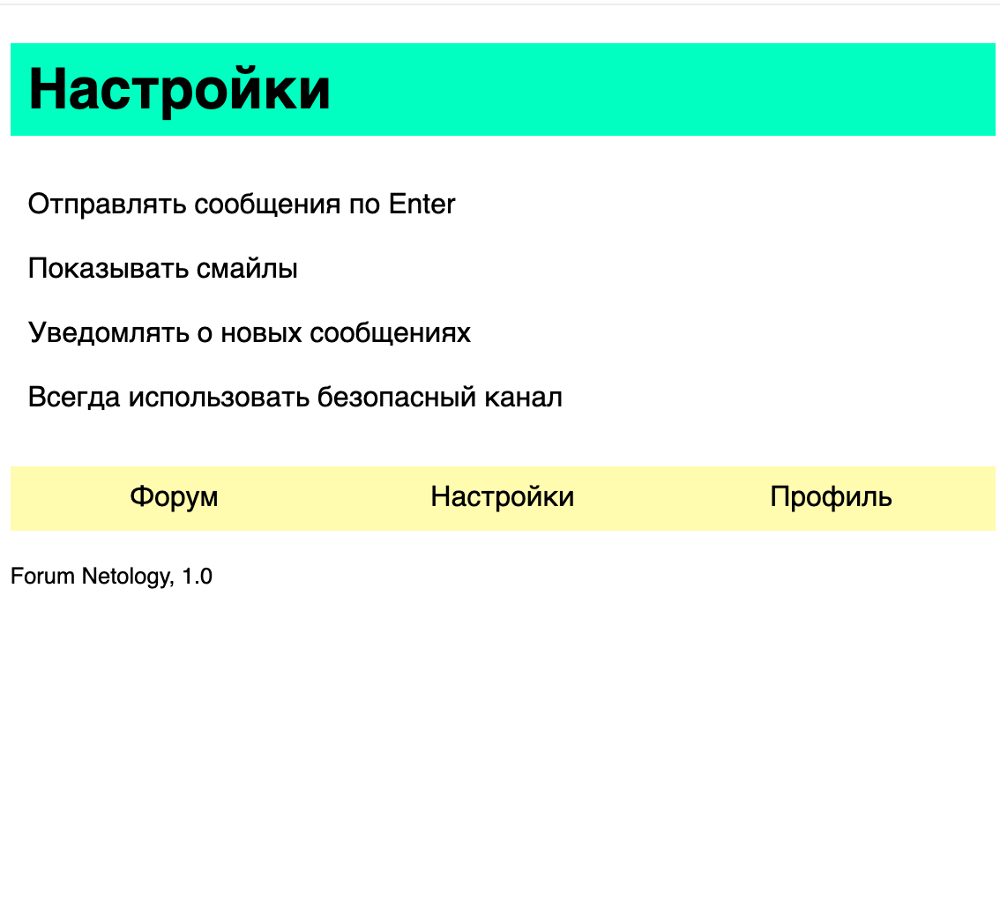

# Домашнее задание к занятию 3.1 Функция без параметров. Область видимости

После успешной реализации мессенджера заказчик пожелал корпоративный форум для сотрудников. Мы использовали готовое решение, но требуются некоторые доработки.

## Задача № 1

В конце страницы форума нужно отображать информацию о текущей версии — создадим функцию, которая будет печатать эту информацию.

### Процесс реализации
1. Объявите функцию `about`, которая будет печатать строку `Forum Netology, 1.0.`, версию приложения храните в переменной внутри функции.
2. Вызовите функцию. Убедитесь, что она работает.


## Задача № 2

Информация об авторизованном пользователе хранится в глобальном объекте `user`. Вот пример такого объекта:

```js
let user = {
    name: "Иван Иванов",
    login: "killer504",
    reputation: 97,
    messages: [
      {from: "administrator", text: "Вы получили предупреждение за публикаию рекламы на форуме"},
      {from: "Петр", text: "Собираем встречу в субботу в 19:00. Придёшь?"},
      {from: "administrator", text: "Ваш рейтинг был повышен пользователем DonkeyKong"},
      {from: "administrator", text: "Ваш рейтинг был повышен пользователем Netologist"},
      {from: "Brian Kerninghan", text: "hello, world"}
    ]
};
```

Напишите функцию, которая будет печатать список сообщений для пользователя.

### Процесс реализации

1. Объявите переменную `user` и заполните ее тестовыми данными.
2. Убедитесь, что переменная `user` не объявлена внутри функции. 
3. В теле функции выполните следующие действия:
4. Напечатайте заголовок `Всего сообщений: n`.
5. Из функции обратитесь к переменной `user`. Напечатайте имя отправителя сообщения и текст сообщения. Шаблон вывода:

```
Имя1 | Текст сообщения
Имя2 | Текст сообщения №2
```
6. Вызовите функцию, убедитесь, что печать выполняется корректно.

***

## Задача № 3

На форуме должен появиться раздел с настройками:


Код для отображения отдельных частей уже написан, но нужно собрать раздел воедино. Разработчик подготовил для вас код четырёх функций, которые выводят на экран части раздела:

* `version` — вывод информации о версии приложения
* `title` — вывод заголовка страницы
* `navigation` — вывод навигации по разделам
* `menu` — вывод меню

Также разработчик сказал, что будет вызывать функцию `page` из файла `script.js` для отрисовки страницы. Ее и нужно написать так, чтобы ваш результат совпал с ожидаемым.

[Заготовка домашнего задания](https://repl.it/@netology_pb/PB-31-Zadaniie-3-Funktsii)


### Процесс реализации

1. Откройте [заготовку домашнего задания](https://repl.it/@netology_pb/PB-31-Zadaniie-3-Funktsii). Всю работу нужно вести в файле `scripts.js`
2. Проанализируйте, в каком порядке нужно вызвать методы, чтобы раздел собрался в нужном порядке
3. Создайте функцию `page` 
4. Вызовите методы отображения частей раздела в нужном порядке
5. Функцию `page` вызывать не нужно, она будет вызываться автоматически при нажатии на кнопку Run
6. Проверьте, что вывод на вкладке *result* совпадает с картинкой из условия


## Инструкция по выполнению домашнего задания

1. Зарегистрируйтесь на сайте [Repl.IT](http://repl.it/).
2. Перейдите в раздел **my repls**.
3. Нажмите кнопку **Start coding now!**, если приступаете впервые, или **New Repl**, если у вас уже есть работы.
4. В списке языков выберите `JavaScript / Nodejs`.
5. Код пишите в левой части окна.
6. Посмотреть результат выполнения файла можно, нажав на кнопку **Run**. Результат появится в правой части окна.
7. После окончания работы нажмите кнопку **Share** и скопируйте ссылку из поля Share link.
8. В личном кабинете на сайте [netology.ru](http://netology.ru/) в поле комментария к домашней работе вставьте скопированную ссылку и отправьте работу на проверку.

При выполнении задания придерживайтесь [правил оформления кода на JavaScript](/codestyle.md).

*Никаких файлов прикреплять не нужно.*

Все задачи обязательны к выполнению для получения зачета. Присылать на проверку можно каждую задачу по отдельности или все задачи вместе. Во время проверки по частям ваша домашняя работа будет со статусом "На доработке".

Любые вопросы по решению задач задавайте в группе на Facebook.
