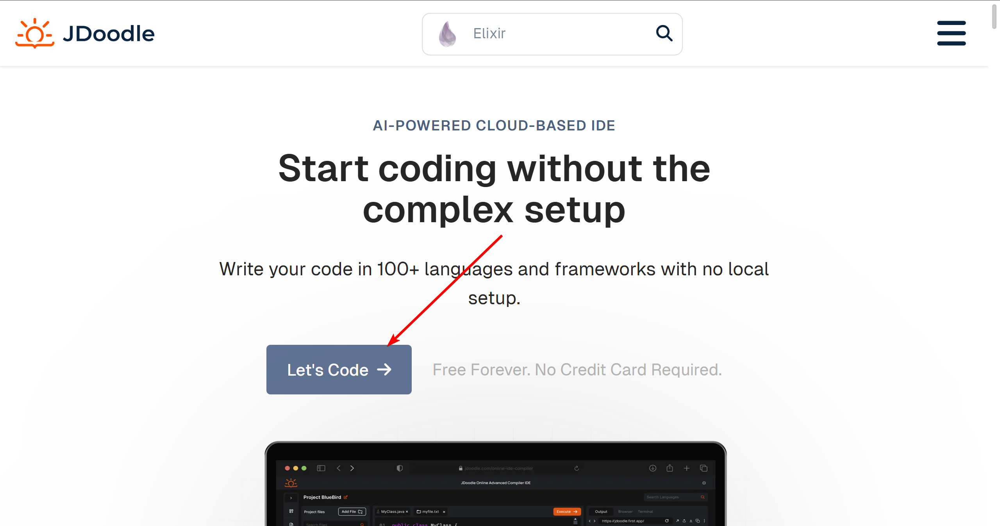
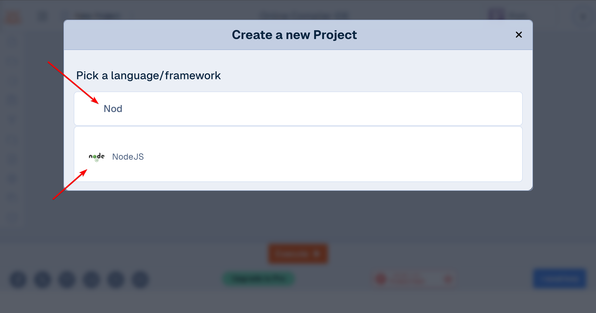

# Пошаговая инструкция Jdoodle

## Регистрация аккаунта

1) Перейдите на сайт https://codesandbox.io.
2) На главной странице в правом верхнем углу нажмите кнопку *Sign In*.
3) Авторизуйтесь через сторонний аккаунт (Google, GitHub или Apple)

## Создание нового проекта

1) Для создания проекта на [странице профилял](https://codesandbox.io/dashboard/recent) нажмите на кнопку *+ Create*.
2) Выберите язык: В раскрывающемся меню вверху выберите нужный язык. На данном курсе, все домашние задания сдаются с помощью NodeJS.
3) Дайте имя проекту в поле *Name*.
4) Измените настройки доступа *Visibility* на *Public (everyone can view)*
5) Нажмите *Create Devbox*

6) Решение заданий пишите в файле `index.js`

7) Используйте комбинацию клавиш *Ctrl + S* для сохранения проекта (так же, проект автоматически сохраняется, спустя некоторое время). 
8) Запук проекта происходит автоматически. Результат программы можно увидеть в терминале снизу

9) Для отправки решения на проверку, используйте кнопку *Share*
10) В модальном окне проверьте доступ (*Public*), скопируйте ссылку на проект по кнопке "Copy". Скопированную ссылку отправляйте на проверку

