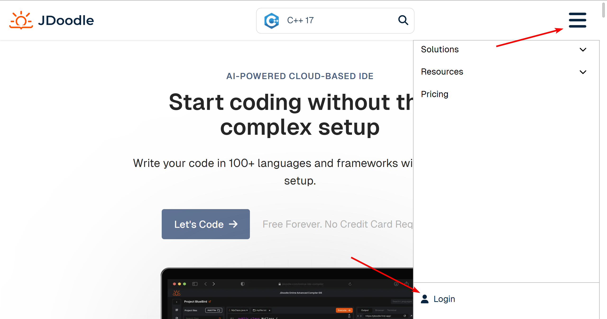
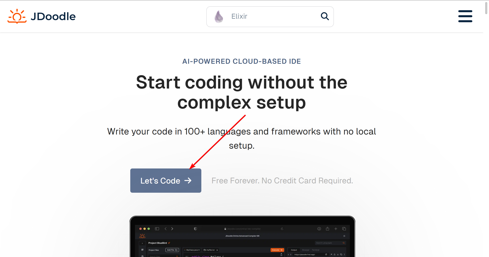
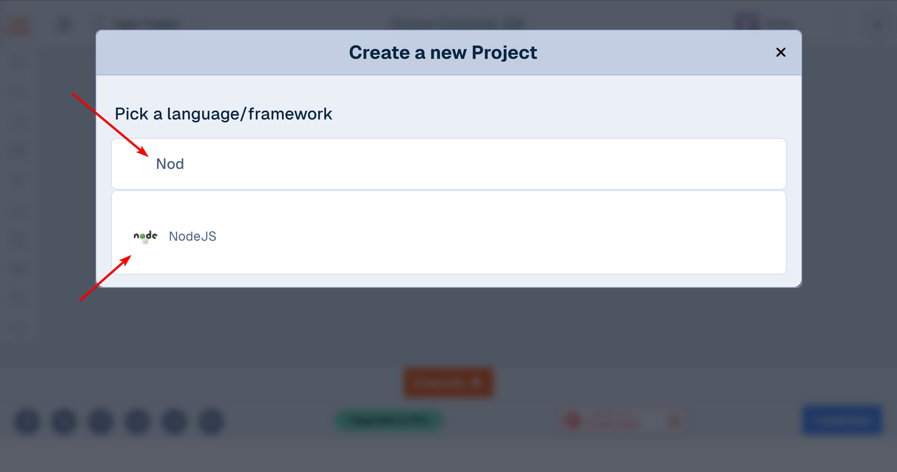
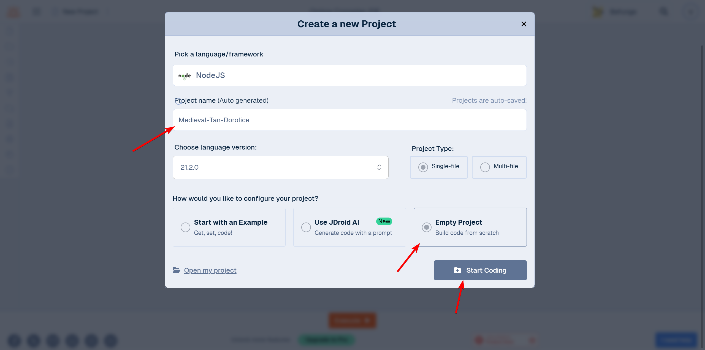
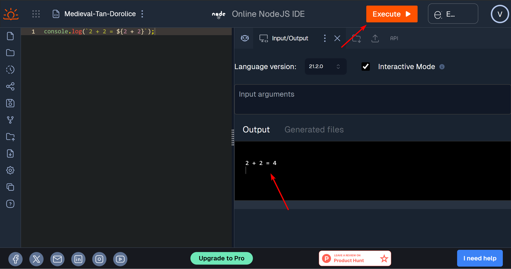
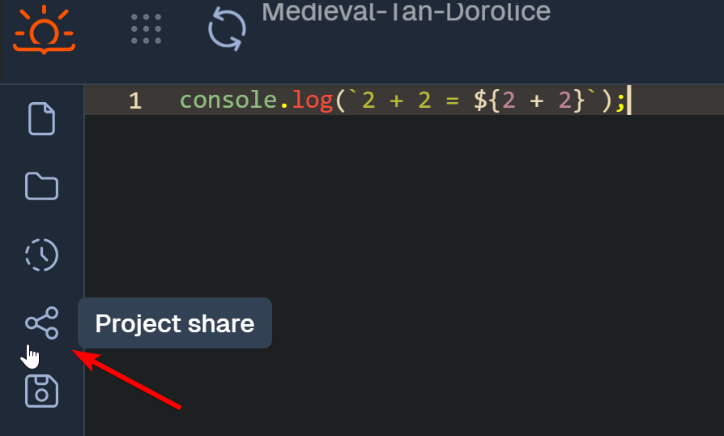
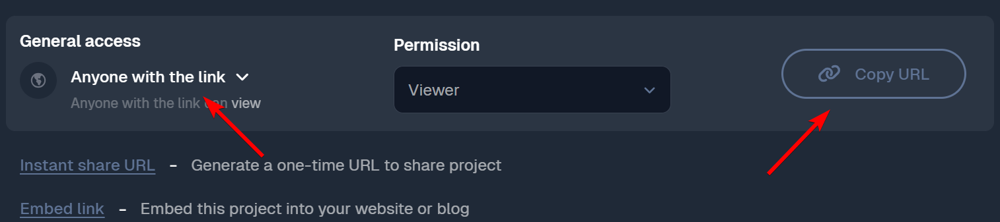

# Пошаговая инструкция Jdoodle

## Регистрация аккаунта

1) Перейдите на сайт https://www.jdoodle.com.
2) На главной странице в правом верхнем углу нажмите кнопку "бургер".
3) Заполните необходимые поля, указав свое имя, email и пароль (или используйте для входа аккаунт GitHub/Google).
4) После регистрации подтвердите свой email, перейдя по ссылке в письме, если это потребуется.

## Создание нового проекта

1) Для создания проекта на [главной странице](https://www.jdoodle.com/) нажмите на кнопку "Let's Code".

2) Выберите язык: В раскрывающемся меню вверху выберите нужный язык. На данном курсе, все домашние задания сдаются с помощью NodeJS. Чтобы не искать каждый раз, воспользуйтесь полем поиска.

3) Дайте имя проекту. Укажите конфигурацию пустого проекта и перейдите в редактор с помощью кнопки "Start Coding"

4) Напишите свой код в центральном окне редактора. Для запуска кода используйте кнопку "Execute".

5) Чтобы поделиться проектом используйте кнопку "Project share" в левом боковом меню

В появившемся модальном окне настройте права доступа ("Доступно всем, у кого есть ссылка"), скопируйте ссылку на проект по кнопке "Copy URL". Скопированную ссылку отправляйте на проверку

